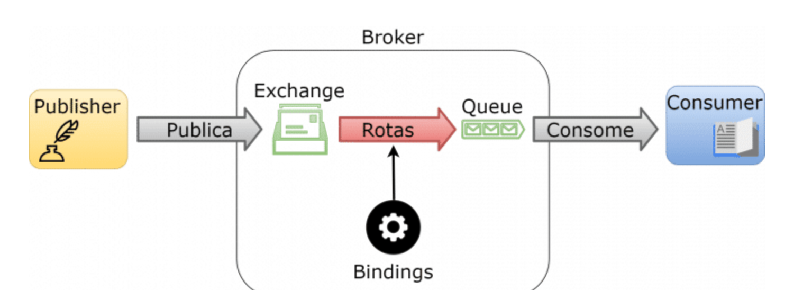
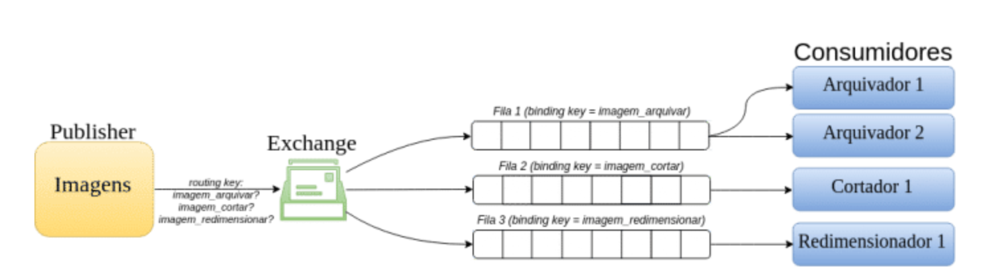
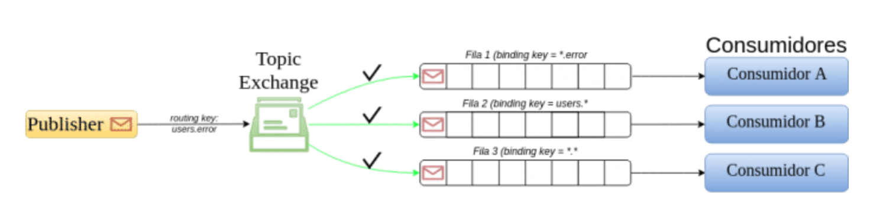
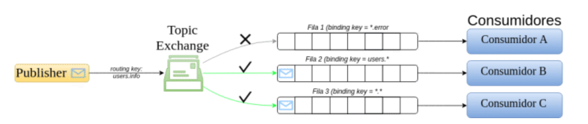
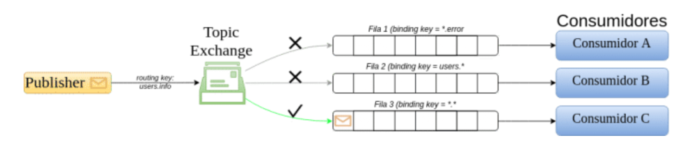

# **AMQP**

**AMQP** *(Advanced Message Queuing Protocol)* pode ser entendido como um protocolo pertencente à mesma camada do **HTTP** que “roda acima” do protocolo **TCP**, que pertence à camada de transporte. O **AMQP** é um protocolo que permite o envio e recebimento de mensagens de forma assíncrona – ou seja, quando enviamos uma mensagem não esperamos uma resposta imediata – independente do hardware, sistema operacional e linguagem de programação. De forma bastante genérica (e com ressalvas: vide referências), o **AMQP** pode ser enxergado como o equivalente assíncrono do **HTTP**, onde um cliente é capaz de se comunicar com um **broker** “no meio do caminho”.

## **Breve Histórico**

O **AMQP** é um protocolo originalmente desenvolvido pela comunidade atuante no mercado financeiro, baseado no cliente (**customer-driven**) que visa permitir a interoperabilidade entre dispositivos. Atualmente, a versão do protocolo padronizada pela **ISO/IEC 19464** é a **1.0**. No entanto, vamos focar aqui na utilização do **RabbitMQ** como broker de **AMQP** e, nativamente, este broker utiliza o **AMQP 0-9-1** (embora também ofereça suporte ao **AMQP 1.0**). Desta forma, iremos focar no **AMQP 0-9-1**, que é bastante utilizado no RabbitMQ e em outros brokers.

## **Conceitos Iniciais**

O **broker** é uma entidade que recebe mensagens de **publishers** – ou seja, clientes que produzem mensagens – e encaminha mensagens a consumidores, que são clientes que recebem (consomem) mensagens. Assim, o **AMQP** é um protocolo bi-direcional onde um cliente pode enviar e receber mensagens de outros clientes através do **broker**.

Ao publicar uma mensagem, o cliente **publisher** encaminha esta mensagem a outra entidade denominada **exchange**, que de acordo com regras específicas (e programáveis!) denominadas **bindings** as encaminham para filas (**queues**) que, por sua vez, podem estar sendo consumidas por um outro cliente, o **consumer**. **Broker**, **publishers**, **consumers**, **exchanges**, **bindings** e **queues** são as palavras chaves para entender o funcionamento do protocolo.
“o **AMQP** é um grande canivete suíço: ele oferece uma grande variedade de regras que podem ser altamente personalizadas de acordo com a finalidade de nossa aplicação.”

De forma simples e resumida, o funcionamento do **AMQP** pode ser comparado a um sistema de correios conforme mostra a figura abaixo 

O cliente **Publisher** escreve uma mensagem e a encaminha para um **exchange**, que se assemelha a uma caixa de correio. A seguir, já no **broker** – que pode ser entendido como os Correios, por exemplo – esta mensagem é encaminhada de acordo com regras específicas (**bindings**) através de rotas a uma **queue**, que pode ser entendida como uma caixa postal, por exemplo. Finalmente, um cliente **Consumer** monitora a **queue** (caixa postal) para, então, ler a mensagem. 

## **Exchanges e seus tipos**

O **exchange** é uma entidade que recebe as mensagens que chegam ao **broker** vindas de aplicações clientes. Estas aplicações desconhecem a existência das filas. É através do **Exchange** que determinada mensagem é roteada para uma ou mais filas a partir de regras denominadas **bindings**. Há alguns tipos de **Exchanges** que implementam diferentes características de roteamento das mensagens recebidas. São tipos de **Exchanges**: **Direct**, **Fanout**, **Topic** e **Headers**. Além do tipo, outros parâmetros definem um **Exchange**: nome, durabilidade, auto-delete, argumentos, etc.

As mensagens que são publicadas no **broker** e as mensagens que são consumidas possuem um parâmetro chamado **routing key**, que no caso de filas que são atreladas a um **exchange**, também pode ser chamado de **binding key**. Este parâmetro nada mais é do que um identificador do caminho da mensagem e serve de base para armazenar corretamente as mensagens em filas. 

### **Direct Exchange**

O **Exchange** do tipo **Direct** entrega mensagens às filas de acordo com o **routing key** da mensagem. Isto é, se uma fila foi **bounded** (roteada) a um exchange com determinado **routing key** **(binding key)**, toda mensagem que chegar ao broker destinada a um exchange do tipo **Direct** com determinado **routing key**, será redirecionada à fila associada a este mesmo **routing key** (binding key). Este tipo de exchange é utilizado principalmente para a distribuição de tarefas entre diversos consumidores.

### **Topic Exchange**

O **Exchange** do tipo Tópico (**Topic**) é utilizado para comunicação no padrão publica/subscreve (**publish/subscribe**) e, assim, é utilizado para monitorar mensagens de acordo com padrões no **routing key** da mensagem, ou seja, o consumidor pode “escolher” que tipo de mensagem deseja receber e, simetricamente, quem publica a mensagem no Exchange indica um assunto/tópico – através do routing key – ao qual a mensagem se refere.

Como um exemplo de aplicação, suponha que gostaríamos de implementar um sistema de logs no qual os consumidores monitoram mensagens de log de diferentes origens/módulos (kernel do sistema, gerenciamento de usuários, rede) e de diferentes níveis (informação, alertas, erros). Cada mensagem gerada contém tanto a origem (kernel/users/network) como o nível do log (info/warning/error) representados como uma lista de dois elementos (poderiam ser mais!) separados por pontos (“.”) no r**outing key**. Por exemplo, a mensagem que contém o **routing key** igual a “ker.info” representa uma mensagem de log gerada pelo kernel do sistema e representa um nível informacional.

Essa figura representa o roteamento para uma mensagem com routing key igual a “users.info”. Observe que, para este caso, o binding key da fila 1 não é satisfeito e, portanto, a mensagem não é entregue ao **consumidor A**

Essa figura exibe o roteamento para uma mensagem com routing key igual a “kern.warning”. Observe que somente o **Consumidor C** recebe a mensagem, uma vez que é o único consumidor da fila que possui um binding compatível com a mensagem.
