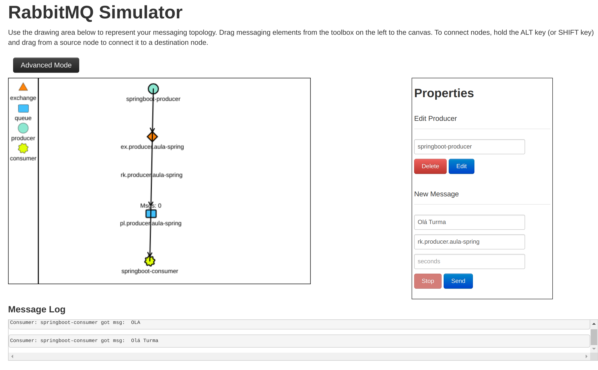

# DevInHouse Senior módulo 3 semana 9

Conteúdo produzido no módulo 3 da semana 9 do DevInHouse Senior - Mensageria

## Objetivo

Neste repositório você encontrará os projetos produzidos como forma prática de fixar o conteúdo téorico abordado durante esta semana.

Os tópicos abordados foram :

* Protocolo [AMQP](./AMQP.md);
* Definição de Broker;
* Definição de Publishers;
* Definição de Exange e seus tipos;
* Definição de Queue;
* Definição de Consumer;
* Uso prático da ferramenta RabbitMQ + SpringBoot ;

Atravéz da ferramenta [RabbitMQ Simulator](http://tryrabbitmq.com/) foi construido o seguinte cenário abaixo:



Como **Broker** foi usado a ferramenta [**RabbitMQ**](https://www.rabbitmq.com/)

Os módulos práticos produzidos foram:

* [spring-consumer](./spring-consumer)
* [spring-producer](./spring-producer)

Sendo **spring-producer** o criador das mensagens e o **spring-consumer** o consumidor das mensagens.


## Uso 

Este projeto utiliza  **Java**, **Maven** na estrutura [springboot](https://spring.io/projects/spring-boot)  como ferramentas de projeto.

Para mais informações consulte suas documentações oficiais.

> Dica : Caso você não conheça a ferramenta [sdkman](https://sdkman.io/) ela irá ajudar a administrar as ferramentas usada neste projeto.

Também utiliza o [docker ](https://docs.docker.com/) para iniciar o  [**RabbitMQ**](https://www.rabbitmq.com/) juntamento com uma ferramenta cliente que envie requisições *rest*.

Pode ser utilizado sua **IDE** de preferência desde que atenda as tecnologias usadas no projeto.

### Tecnologias

* JDK 8 ou posterior;
* Maven 3.8 ou posterior;
* Docker 20.10.14 ou posterior;


### Setup

* 1 - Clone este projeto em um diretório local;

* 2 - Inicie o RabbitMQ através da instrução abaixo:

  ``` bash
  docker run -d -p 15672:15672 -p 5672:5672 --name rabbitmq-senior rabbitmq:3-management
  ```

* 3 - Importe os projetos [spring-consumer](./spring-consumer) e [spring-producer](./spring-producer) em sua IDE de preferência;

* 4 - Inicie os projetos;

* 5 - Com uma ferramenta cliente que envie requisições *rest*, envie uma requisição para o produtor ([spring-producer](./spring-producer) )

  Exemplo usando a ferramenta [Postman](https://www.postman.com/)


Após enviar a mensagem acesse a url http://localhost:15672/ e informe as informações de acesso padrões;

* user: guest
* pass: guest

Vá na aba **Queues** e você verá que foram criadas as filas juntamente com a mensagem criada confrome imagem abaixo:


Após o envio da mensagem você verá no console de sua IDE no módulo [spring-consumer](./spring-consumer) a mensagem consumida conforme imagem abaixo:

